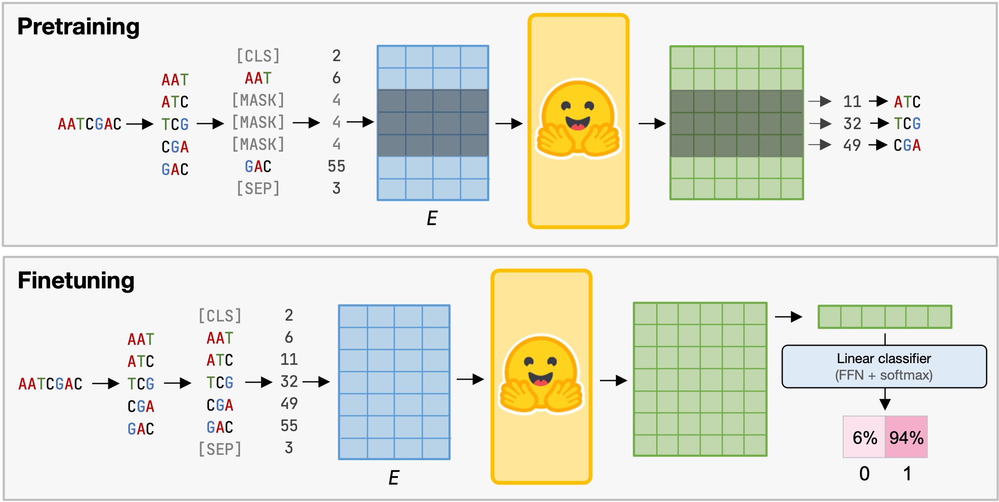

# TransforKmers

A task-agnostic facility to pretrain/finetune and use a Transformer based model to classify your DNA/RNA sequences.

This repo is a wrapper around HuggingFace adapted to biological sequences. It's useful to easily
pretrain, finetune and use a transformer architecture powered by HuggingFace for a classification
task.

## Install

Follow [recommandations](https://pytorch.org/get-started/locally/#start-locally) to install PyTorch on your system. Example:

```sh
conda install pytorch -c pytorch
```

Then, install TransforKmers with pip:

```sh
pip install git+https://github.com/mlorthiois/transforkmers
```

## General usage

This command run the model on every sequences of the fasta, and write results in a csv file.

```sh
transforkmers predict \
    --model_path_or_name /path/to/pretrained/model/dir/ \
    --tokenizer /path/to/tokenizer/dir/ \
    --input /path/to/input.fa
```

## Train from scratch



If you want to train a new model from scratch, several steps are provided.

- For real examples, check used scripts inside `/scripts/`.
- If you want to use an already pretrained model, go to step 4.

### 1. Create a tokenizer.

Next, you need a tokenizer to split and label your input sequences in kmers.

```sh
transforkmers tokenizer \
    --k 6 \
    --alphabet "A,T,C,G" \
    --max-len 512 \
    --output config/tokenizer_k6_512/
```

> If you want to use amino acid sequences, use all 20 AA in alphabet and set a k of 1.

### 2. Pretrain your model.

The pretraining is done with the `Masked Language Model (MLM)` method.
To do so, you first need to pick random sequences inside a reference genome.
It can be done with the command below:

```sh
transforkmers pretrain-dataset \
    --fasta /path/to/reference/fasta \
    --num-seq 2000000
```

Once you have your pretraining dataset and your tokenizer, you can pretrain
from scratch your transformer based model.
To see all the models availabled, please check [HuggingFace](https://huggingface.co/docs/transformers/index).

```sh
transforkmers pretrain \
    --output_dir "models" \
    --model_path_or_name "HuggingFaceModelType" \
    --tokenizer /path/to/tokenizer/dir/ \
    --dataset /path/to/dataset.txt
```

> Overload your model config with: `--overload_config "hidden_size=516,num_hidden_layers=8"`

### 3. Finetune a pretrained model.

Once your model is pretrained, it can be used in any classification task.

First, you have to create your finetune dataset.
`--inputs` takes a list of fasta, and maps each sequences to its rank (from 0).

```sh
transforkmers finetune-dataset \
    --inputs \
        /path/to/a.fa \  # Each sequences will be class 0.
        /path/to/b.fa \  # Each sequences will be class 1.
        /path/to/c.fa \  # Each sequences will be class 2.
        /path/to/d.fa \  # Each sequences will be class 3.
    --split 75,10,15 \
    --max-len 512
```

You can now finetune your model on the previously generated train and valid datasets.

```sh
transforkmers finetune \
    --model_path_or_name /path/to/pretrained/model/dir/ \
    --tokenizer /path/to/tokenizer/dir/ \
    --train_dataset /path/to/train.csv \
    --eval_dataset /path/to/eval.csv
```

After the finetuning, you can test your model with your test dataset.

```sh
transforkmers test \
    --model_path_or_name /path/to/finetuned/model/dir/ \
    --tokenizer /path/to/tokenizer/dir/ \
    --test_dataset /path/to/test.csv
```
